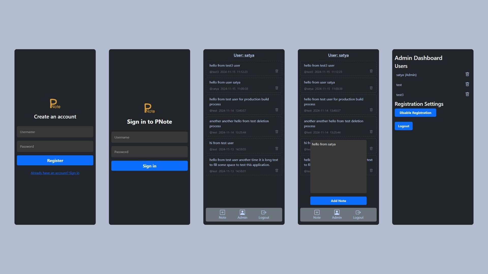

# pnote

sample note taking website for parsonal or among friends



# Run this Locally

1.  Fork the repository or download it locally
2.  install all the packages

    ```bash
    npm install
    ```

3.  create .env file and

    ```bash
    DATABASE_URL= your postgres database url
    JWT_SECRET= your secret
    ```

4.  run the webapp

    ```bash
    npm run dev
    ```

    Website run on [http://localhost:3000/](http://localhost:3000/)

## me

Satyabrata Saha
<br>
x.com - [@satya_saha_](https://x.com/satya_saha_)
<br>
email- hello.satyabrata.saha@gmail.com